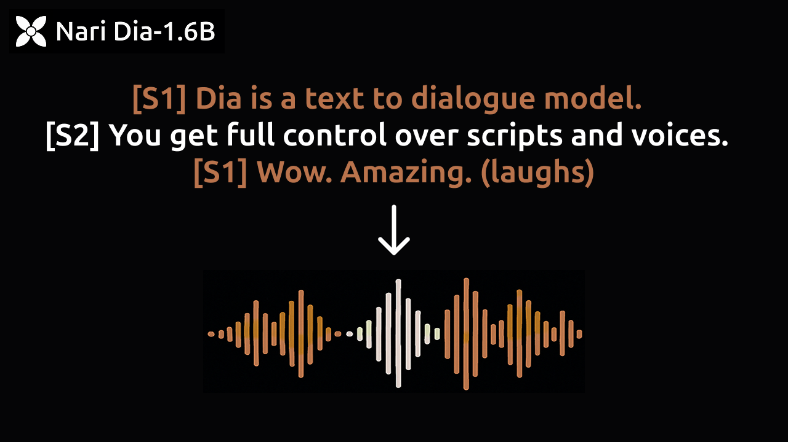

<p align="center">
<a href="https://github.com/nari-labs/dia">

</a>
</p>
<p align="center">
<a href="https://tally.so/r/meokbo" target="_blank"></a>
<a href="https://discord.gg/pgdB5YRe" target="_blank"></a>
<a href="https://github.com/nari-labs/dia/blob/main/LICENSE" target="_blank"></a>
</p>
<p align="center">
<a href="https://huggingface.co/nari-labs/Dia-1.6B" target="_blank"></a>
<a href="" target="_blank"></a>
</p>

Dia is a 1.6B parameter text to speech model created by Nari Labs.

Dia **directly generates highly realistic dialogue from a transcript**. You can condition the output on audio, enabling emotion and tone control. The model can also produce nonverbal communications like laughter, coughing, clearing throat, etc.

To accelerate research, we are providing access to pretrained model checkpoints and inference code. The model weights are hosted on [Hugging Face](https://huggingface.co/nari-labs/Dia-1.6B).

We also provide a [demo page](https://yummy-fir-7a4.notion.site/dia) comparing our model to [ElevenLabs Studio](https://elevenlabs.io/studio) and [Sesame CSM-1B](https://github.com/SesameAILabs/csm).

- Join our [discord server](https://discord.gg/pgdB5YRe) for community support and access to new features.
- We’re turning Dia into a B2C app. Generate fun conversations, remix content, and share with friends. Join the [waitlist](https://tally.so/r/meokbo) for early access.

## Quickstart

This will open a Gradio UI that you can work on.

```bash
git clone https://github.com/nari-labs/dia.git
cd dia && uv run app.py
```

## Usage

### As a Python Library

```python
import soundfile as sf

from dia.model import Dia


model = Dia.from_pretrained("nari-labs/Dia-1.6B")

text = "[S1] Dia is an open weights text to dialogue model. [S2] You get full control over scripts and voices. [S1] Wow. Amazing. (laughs) [S2] Try it now on Git hub or Hugging Face."

output = model.generate(text)

sf.write("simple.mp3", output, 44100)
```

### Command-Line Interface (CLI)

The CLI script `cli.py` in the project root allows generation from the terminal.

**Basic Usage (Loading from Hub):**

```bash
python cli.py "Your input text goes here." \
    --output generated_speech.wav \
    --repo-id nari-labs/Dia-1.6B
```

**Loading from Local Files:**

```bash
python cli.py "Text for local model." \
    --output local_output.wav \
    --local-paths \
    --config path/to/your/config.json \
    --checkpoint path/to/your/checkpoint.pth
```

**With Audio Prompt:**

```bash
python cli.py "Generate speech like this prompt." \
    --output prompted_output.wav \
    --repo-id nari-labs/Dia-1.6B \
    --audio-prompt path/to/your/prompt.wav
```

**Adjusting Generation Parameters:**

```bash
python cli.py "Adjusted generation." \
    --output adjusted_output.wav \
    --repo-id nari-labs/Dia-1.6B \
    --temperature 1.0 \
    --top-p 0.9 \
    --cfg-scale 4.0
```

## License

This project is licensed under the Apache License 2.0 - see the [LICENSE](LICENSE) file for details.

## Disclaimer

This project offers a high-fidelity speech generation model intended solely for research and educational use. The following uses are **strictly forbidden**:

- **Identity Misuse**: Do not produce audio resembling real individuals without permission.
- **Deceptive Content**: Do not use this model to generate misleading content (e.g. fake news)
- **Illegal or Malicious Use**: Do not use this model for activities that are illegal or intended to cause harm.

By using this model, you agree to uphold relevant legal standards and ethical responsibilities. We **are not responsible** for any misuse and firmly oppose any unethical usage of this technology.

## TODO / Future Work

- Optimize inference speed.
- Add quantization for memory efficiency.

## Contributing

We are a tiny team of 1 full-time and 1 part-time research-engineers. We are extra-welcome to any contributions!
Join our [Discord Server](https://discord.gg/pgdB5YRe) for discussions.

## Acknowledgements

- We thank the [Google TPU Research Cloud program](https://sites.research.google/trc/about/) for providing computation resources.
- Our work was heavily inspired by [SoundStorm](https://arxiv.org/abs/2305.09636), [Parakeet](https://jordandarefsky.com/blog/2024/parakeet/), and [Descript Audio Codec](https://github.com/descriptinc/descript-audio-codec).
- "Nari" is a pure Korean word for lily.
